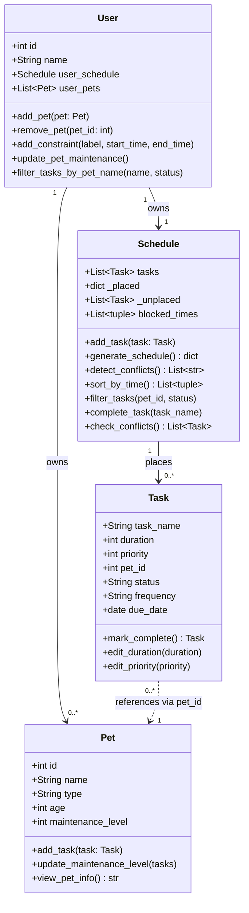

# PawPal+ TA Reference Guide

> **Audience:** Teaching Assistants supporting students in office hours, Slack, and breakout rooms.
> **Purpose:** Fast access to practical knowledge for troubleshooting, debugging, and explaining concepts — not for grading.
>
> **Important note:** Students may design their systems differently. This guide is built around the core learning objectives, not any single implementation. Use it to support a wide range of valid student designs.

---

## Table of Contents

1. [Project Overview](#1-project-overview)
2. [Core Concepts Students Must Understand](#2-core-concepts-students-must-understand)
3. [Common Student Questions (FAQ)](#3-common-student-questions-faq)
4. [Most Common Bugs](#4-most-common-bugs)
5. [TA Debugging Playbook](#5-ta-debugging-playbook)
6. [AI Usage Lessons](#6-ai-usage-lessons)
7. [Architecture Deep Dive](#7-architecture-deep-dive)
8. [TA Cheat Sheet (1-Page Quick Reference)](#8-ta-cheat-sheet-1-page-quick-reference)
9. [Reflection & Teaching Insights](#9-reflection--teaching-insights)

---

## 1. Project Overview

### What PawPal+ Is

PawPal+ is a pet care scheduling app. A pet owner enters their pets and the care tasks each pet needs (walks, feeding, grooming, medication, etc.). The app generates a daily schedule that respects priority, time constraints, and recurring patterns — and warns the user when tasks conflict or can't fit.

The project is fundamentally about applying software design skills to a real-world problem. The pet care domain is the vehicle; the real goals are modular class design, scheduling logic, conflict detection, and AI collaboration.

---

### The Four Learning Objectives

| Objective | What it looks like in the project |
|---|---|
| **Modular OOP design** | Separate classes for Owner/User, Pet, Task, and Schedule — each with clear responsibilities |
| **Algorithmic logic** | Sorting tasks, detecting conflicts, handling recurring tasks |
| **Verification** | A CLI demo script + automated `pytest` tests for key behaviors |
| **AI collaboration** | Using AI for brainstorming and code generation, then reflecting on what worked and what didn't |

---

### Typical Architecture (Students May Vary)

Most students will design something like this:

```
app.py  (Streamlit UI — what the user sees)
  └── imports → core logic file(s)
                  ├── Owner / User class
                  │     owns → Schedule (usually one per owner)
                  │     owns → List of Pets
                  ├── Schedule class
                  │     holds → tasks (unscheduled pool)
                  │     places → scheduled tasks (often a dict or list)
                  ├── Pet class
                  └── Task class
```

Students may split classes across multiple files, combine some classes, or name them differently (e.g., `Owner` vs `User`, `CareTask` vs `Task`). All of these can be valid. What matters is that each class has a **clear, focused responsibility** and that responsibilities don't bleed between classes.

---

### The Three Entry Points

| File | Purpose |
|---|---|
| CLI demo script (e.g., `main.py`) | Demonstrates scheduling/conflict logic directly in the terminal. No UI required. |
| Streamlit app (e.g., `app.py`) | Interactive web UI. Calls the core logic and displays results. |
| Test suite (e.g., `tests/test_*.py`) | Automated `pytest` tests verifying key behaviors in isolation. |

All three should call the same underlying logic. If they don't, that's a red flag for separation of concerns issues.

---

## 2. Core Concepts Students Must Understand

---

### Object-Oriented Programming

#### Classes and Objects

**Simple explanation:** A class is a blueprint. An object is a specific thing made from that blueprint. You can make many objects from one class.

**In PawPal+:** `Pet` is the blueprint. Creating `dog = Pet(name="Buddy", ...)` makes one specific dog object. A second pet `cat = Pet(name="Whiskers", ...)` is a different object from the same blueprint. They share behavior (same methods) but have different data.

**Why students get confused:** They confuse the class definition with an instance. They write `Pet.name` instead of `dog.name`. Or they think you can only make one of each class. Another confusion: thinking multiple similar things don't need a class because "the code looks the same."

---

#### Encapsulation

**Simple explanation:** Each class owns its own data and provides methods to work on that data. Outside code should use those methods rather than reaching in and directly changing internal values.

**In PawPal+:** A task's status should change through a method like `mark_complete()`, not by directly assigning `task.status = "complete"`. Why? Because the method can also handle side effects — like creating the next occurrence for a recurring task — that a direct assignment would skip.

**Why students get confused:** Python doesn't enforce private access the way Java does. Nothing stops a student from writing `task.status = "complete"`. The bug it creates is subtle: the status changes, but the recurring logic never runs.

---

#### Relationships Between Classes

**Simple explanation:** Classes can reference each other. One class can *own* another, *use* another, or *contain a list* of another.

**Common relationships in PawPal+:**
- An **Owner/User owns** one Schedule and a list of Pets
- A **Schedule contains** Tasks (unscheduled pool + placed tasks)
- A **Task references** a Pet — usually by a pet ID (integer), not a direct object reference

**Why the pet ID approach matters:** If a task held a direct reference to a `Pet` object, deleting or modifying the pet could silently break all tasks assigned to it. Using a pet ID keeps tasks independent and makes them easier to serialize or pass around.

**Why students get confused:** Students expect Task to hold a Pet object. When they see `pet_id: int`, they don't understand why — explaining the indirection is worthwhile.

---

### System Architecture and Separation of Concerns

**Simple explanation:** Logic lives in one place; the UI lives in another. The goal is that the core scheduling logic should work perfectly with or without the Streamlit UI.

**The key test:** Can you run your scheduling logic from a plain Python script (`main.py`) with no Streamlit? If yes, your separation is good. If your logic is tangled up in `app.py`, it's not.

**Why this matters practically:** Automated tests (`pytest`) test the logic directly. If the logic is inside Streamlit code, you can't test it without launching the app.

**Why students get confused:** When they hit a bug, they don't know if the problem is the logic or the UI. Separation eliminates that ambiguity.

---

### CLI-First Development

**Simple explanation:** Build and test your logic in a plain Python script before connecting it to Streamlit. Debugging is much faster without a browser involved.

**Recommended workflow:**
1. Design classes and methods on paper / in a UML diagram
2. Implement logic in a core Python file
3. Test that logic in `main.py` (print things, trace results)
4. Write `pytest` tests to lock in correct behavior
5. Connect to Streamlit *last*

Students who skip to the UI first struggle with two sources of bugs simultaneously.

---

### Streamlit Frontend vs Backend Logic

**Simple explanation:** Streamlit reruns the entire `app.py` script from top to bottom on every user interaction (button click, text input change, selectbox selection, etc.). Any variable not saved to `st.session_state` is lost between reruns.

**The mental model students need:** Think of Streamlit as a loop that runs your script over and over. Each run starts fresh unless you use session state as persistent storage.

**Common symptoms of missing session state:**
- "I added a pet, then clicked another button and it disappeared"
- "My owner object resets to None every time I interact with the page"
- "The task pool empties every time I click Generate"

**Why students get confused:** They're used to running a script once. The re-run model is unintuitive until you've seen the symptom.

---

### Scheduling Algorithms

**Simple explanation:** A scheduler must answer: "Given a list of tasks and a set of constraints, when should each task happen?"

**Common design approaches students take:**

| Approach | How it works | Trade-off |
|---|---|---|
| Greedy by priority | Sort by priority (high → low), place each task at the earliest free slot | Simple, predictable, but may block efficient arrangements |
| First-come, first-served | Tasks placed in the order they were added | Simple but ignores priority |
| Time-window matching | Use task names or labels to prefer specific time ranges (e.g., "breakfast" → morning) | More natural output but requires keyword matching |
| Manual placement | User specifies the exact time for each task | Most flexible, but no automation |

Most students use some version of greedy by priority. The key insight is that **greedy algorithms are not optimal but are predictable and "good enough"** for this use case.

**Trade-off to discuss:** A greedy scheduler that places a long, high-priority task first might block several short, lower-priority tasks that would have fit if the order were different. For a pet care app, this is acceptable — a user expects high-priority tasks to take precedence.

---

### Task Prioritization

**Simple explanation:** Priority is a number the user assigns to indicate importance. The scheduler uses this number to decide which tasks to place first.

**Common design choices:**
- A 1–5 scale (1 = low, 5 = high) — used in this implementation
- A 1–3 scale (low/medium/high)
- User-defined labels ("urgent", "normal", "optional")

**Critical distinction:** Priority should be user-defined, not auto-calculated from pet health. A student who makes priority a function of pet maintenance level will break the logic — a pet medication task should always be high priority regardless of how healthy the pet currently seems. (This was an actual AI suggestion that needed to be rejected.)

---

### Recurring Task Logic

**Two separate ideas that students frequently mix up:**

**Intra-day recurrence:** A task repeats multiple times *within the same day* (e.g., "water check every 2 hours"). The scheduler creates multiple copies of the task before placing them.

**Cross-day recurrence:** A task repeats on future days (e.g., "daily walk", "weekly vet weigh-in"). When the task is marked complete, a new task object is created for the next occurrence (tomorrow, or next week).

**Why students confuse these:** Both involve "repeating" a task. The difference is *when* the repetition happens. Students who mix these up end up with tasks that duplicate incorrectly — appearing dozens of times within a single day, or never appearing on future days.

**Debugging question:** "When you say 'recurring', do you mean it should happen multiple times *today*, or again *tomorrow*?"

---

### Conflict Detection

**Simple explanation:** After tasks are placed on the schedule, check every pair of tasks to see if they overlap in time. Two tasks conflict if one starts before the other finishes.

**The overlap rule:** Task A `(a_start, a_end)` and Task B `(b_start, b_end)` overlap when:
```
a_start < b_end  AND  b_start < a_end
```
The edge case: if task A ends exactly when task B starts, that is **not** a conflict — they're sequential. Students often get this wrong.

**Important design distinction (students may design this differently):**
- "Tasks that overlap" → these are *conflict warnings*
- "Tasks that couldn't be placed at all" → these are *unplaced tasks*

Both are useful to surface, but they're different concepts. A student who reports only one and not the other is missing half the picture.

**Conflict detection should warn, not crash.** The schedule can still be displayed even when conflicts are detected — the user is informed so they can adjust.

---

### Data Structures

Students may represent their schedules in different ways. Common choices:

| Structure | Common use |
|---|---|
| `list` of tasks | Simple, easy to iterate; doesn't encode time |
| `dict` mapping time → task | Fast lookup by start time; can't have two tasks at the same start minute |
| `list` of `(start_time, task)` tuples | Preserves ordering; easy to sort |
| Custom class | Encapsulates time range; more expressive |

**One gotcha with dicts:** If the dict key is start time and two tasks share the same start time, the second silently overwrites the first. Students using dicts should be aware of this.

---

## 3. Common Student Questions (FAQ)

---

**Q: Why do we need separate classes? Why can't everything go in one file or one big class?**

Likely cause: Student hasn't yet internalized the separation of concerns principle.

Guide without giving away: Ask them to imagine the schedule for a dog park — the park doesn't know the dog's name, and the dog doesn't know when its meals are. Things that *are different* should *be separate.* Then ask: "What changes when you add a second pet? Does the scheduling logic care? Should the Pet object need to know about time slots?" Let them trace the answers.

---

**Q: What is the difference between a Pet and a Task?**

Likely cause: Student thinks tasks belong *inside* the pet rather than in the schedule.

Guide: A pet *exists* — it's a living thing with properties. A task *happens* — it's an event in time. "Morning Walk" doesn't disappear when you change the dog's name. The schedule manages when things happen; the pet manages what the animal is. Ask: "Who tracks *when* things happen — the animal or the calendar?"

---

**Q: Why isn't my task showing up in the schedule?**

Common causes:
1. A task was added to the pool but the schedule was never generated
2. All time slots are blocked (constraint covers the entire day)
3. The task duration is longer than any available free window
4. The student is looking at the wrong data structure (the unscheduled pool vs the placed schedule)

Guide: Ask "Where does a task live before the scheduler runs? Where does it live after?" Lead them to distinguish between the unscheduled pool and the placed/generated schedule.

---

**Q: Why is my recurring task duplicated / showing up dozens of times?**

Likely cause: The student is confusing intra-day recurrence and cross-day recurrence, or they are calling the schedule generator multiple times and the task pool grows each time because completed tasks keep getting added back.

Guide: Ask "When you say recurring, do you mean it should happen multiple times *today*, or again *tomorrow*?" Then ask them to print the task pool before and after generating, and count how many entries there are.

---

**Q: Why is conflict detection not working?**

Common causes:
1. The schedule was never generated, so there are no placed tasks to compare
2. The student is checking the wrong list (e.g., checking the unscheduled pool for conflicts instead of the placed schedule)
3. The overlap condition logic is inverted or uses `<=` instead of `<`, which causes sequential tasks to be falsely flagged
4. The student is conflating "tasks that overlap" with "tasks that couldn't be placed"

Guide: Ask "What does your conflict detection function actually receive as input? Is that list populated?" Then ask them to walk through the overlap math with one specific example.

---

**Q: Why does Streamlit behave differently than my CLI script?**

Likely cause: Student doesn't understand that Streamlit reruns the entire file on every interaction.

Guide: Ask "What happens to a regular Python variable when you run a script, then run it again?" Then: "What does Streamlit do every time you click a button?" The mental model of "every button click = full script re-run" is the unlock.

---

**Q: Why does my sorting look wrong?**

Common causes:
1. Sorting the unscheduled pool (tasks have no time assigned yet) instead of the placed schedule
2. Sorting before the scheduler has run, so the placed schedule is empty
3. Sorting by priority when the goal is to sort by time (or vice versa)

Guide: Ask "What are you sorting — the pool of tasks or the placed schedule? Do tasks in the pool have a time assigned to them yet?"

---

**Q: Why does the UI not match my backend output?**

Likely cause: Session state is stale, or the student modified data in the UI without triggering a regenerate step. Or the logic and UI are entangled and changes to one don't propagate to the other.

Guide: Add a temporary debug display (`st.write(...)`) to show the actual state of the data structure the UI is reading. Compare to the expected value.

---

**Q: My UML diagram doesn't match my code. Do I need to update it?**

This is actually expected and healthy. Guide: "Your UML should reflect what you built, not what you planned. Design changes during implementation are normal — updating the diagram to match is part of good documentation practice." Ask them what changed and why.

---

## 4. Most Common Bugs

These are the most common bugs *across student implementations*, independent of specific design choices.

---

### Bug 1: Tasks Added But Never Scheduled

**Symptom:** Student adds tasks, generates the schedule, but the output is empty or unchanged.

**Root cause:** The student added tasks to a pool/list but the scheduling function wasn't called — or the scheduling function ran on an empty list because the task was added to the wrong attribute.

**Debugging questions:**
- "Can you print your task pool right before you run the scheduler? How many tasks are in it?"
- "What does your placed schedule contain immediately after generating?"
- "Is the task object being added to the same list that the scheduler reads from?"

**Hint progression:**
1. "There are two places tasks can live — before scheduling and after. Which one does your display read from?"
2. "Try printing your task pool just before the scheduler runs. Is your task there?"
3. "If the pool is empty, trace back to where you added the task. Is it being added to the right attribute on the right object?"

---

### Bug 2: Conflict Detection Flags Sequential Tasks

**Symptom:** Tasks that run back-to-back (9:00–9:30, then 9:30–10:00) are reported as conflicting.

**Root cause:** The overlap condition uses `<=` instead of `<`, so the "touching" boundary is counted as an overlap.

**The fix:** Two tasks overlap only when `a_start < b_end AND b_start < a_end`. When task A ends at minute 570 and task B starts at minute 570, `570 < 570` is `False` — no conflict.

**Debugging questions:**
- "What is your exact overlap condition? Can you write it out?"
- "Walk me through this case: task A ends at 9:30, task B starts at 9:30. Does your condition flag this?"

**Hint progression:**
1. "Overlap means one task starts *before* the other finishes. Does 'starts at the same minute one ends' count as overlap?"
2. "Try the condition `a_start < b_end AND b_start < a_end` with the sequential case. What does it evaluate to?"
3. "The fix is strict less-than (`<`), not less-than-or-equal (`<=`)."

---

### Bug 3: Recurring Task Grows Indefinitely

**Symptom:** Each time the schedule regenerates, the same recurring task appears more and more times.

**Root cause:** Completing a recurring task adds the next occurrence back to the task pool. If `generate_schedule()` is called again without clearing the pool, the old tasks plus the new ones all get scheduled. Over multiple calls, the pool balloons.

**Debugging questions:**
- "How many tasks are in your pool before vs after generating? Print the count."
- "When a recurring task is completed, where does the next occurrence go?"
- "Do you clear or reset the pool between schedule generations?"

**Hint progression:**
1. "Print `len(your_task_pool)` before and after generating. Does it grow each time?"
2. "When `mark_complete()` adds a next occurrence to the pool, what happens to that task the next time you generate?"
3. "Consider whether you need to separate 'tasks to schedule today' from 'tasks queued for future days.'"

---

### Bug 4: Two Tasks at the Same Start Time — One Disappears

**Symptom:** The student force-places two tasks at the exact same time. Only one shows up.

**Root cause:** If the placed schedule is a dictionary keyed by start time, assigning the same key twice silently overwrites the first value. No error is raised.

**Debugging questions:**
- "What data structure are you using to store placed tasks?"
- "What happens in Python when you assign the same dictionary key twice?"

**Hint progression:**
1. "Try this in Python: `d = {}; d[480] = 'task_a'; d[480] = 'task_b'; print(d)`. What do you get?"
2. "If your placed schedule is a dict keyed by start time, two tasks at the same time can't both exist."
3. "Either use slightly different start times, or use a list of `(start_time, task)` tuples instead."

---

### Bug 5: Streamlit State Resets on Every Click

**Symptom:** User creates an owner, adds pets, then clicks any button — all data vanishes.

**Root cause:** The owner object is stored as a regular Python variable at the top of `app.py`. Since Streamlit reruns the script on every interaction, the variable is re-initialized to `None` or a fresh object every time.

**Debugging questions:**
- "What does Streamlit do every time the user clicks a button?"
- "Where in your code is the owner object created? Is it inside `st.session_state`?"

**Hint progression:**
1. "Streamlit reruns `app.py` from line 1 every single time any button is clicked."
2. "Regular Python variables don't survive between reruns. What Streamlit provides for persistence is `st.session_state`."
3. "Store your owner in `st.session_state['owner']` and check if it exists before creating a new one."

---

### Bug 6: Priority Sorting Has No Visible Effect

**Symptom:** Tasks appear in the schedule in the order they were added, regardless of priority.

**Root cause:** The student added a sort step but sorted the wrong list, or sorted in ascending order (lowest priority first) when they wanted descending (highest first).

**Debugging questions:**
- "Which list are you sorting — the pool before scheduling, or the placed results?"
- "Are you sorting in ascending or descending order? Which do you want?"

**Hint progression:**
1. "Print your task list before and after the sort. Does the order change?"
2. "Python's `sorted()` defaults to ascending. If 5 is highest priority, what order do you need?"
3. "Pass `reverse=True` to `sorted()` or use `key=lambda t: -t.priority` to put highest priority first."

---

### Bug 7: Conflict Detection Returns Nothing — Even for Real Conflicts

**Symptom:** `detect_conflicts()` (or equivalent) returns an empty list even when tasks obviously overlap.

**Root cause A:** The function is scanning the unscheduled pool instead of the placed schedule — tasks in the pool don't have time positions yet.
**Root cause B:** The schedule hasn't been generated, so the placed schedule is empty.
**Root cause C:** The student is calling the "unplaced tasks" function instead of the "overlapping tasks" function.

**Debugging questions:**
- "What input does your conflict detection receive? Is it the pool or the placed schedule?"
- "Have you generated the schedule before calling conflict detection?"
- "Print the placed schedule before calling conflict detection — how many tasks are in it?"

---

### Bug 8: OOP Design — Logic Put in the Wrong Class

**Symptom:** The scheduler method is defined on `Pet`, or the conflict detection is on `Task`, or the Streamlit UI code contains direct scheduling logic.

**Root cause:** Student hasn't internalized what each class is responsible for. Logic drifts to wherever the student is working at the time.

**Debugging questions:**
- "Is it the Pet's job to know when tasks are scheduled, or the Schedule's?"
- "Could you call this function without a Pet existing? If yes, it probably doesn't belong on Pet."
- "Can you test this scheduling logic without running Streamlit?"

**Hint progression:**
1. "Ask yourself: what is this class *for*? Pet is for pet data. Schedule is for time management. Where does this logic conceptually live?"
2. "If this function is on the wrong class, you'll find yourself passing objects around awkwardly just to use it. Does that feel messy?"
3. "Move the logic to the class that owns the data it needs."

---

## 5. TA Debugging Playbook

A repeatable process for any student stuck on any bug. Adapt the questions to the specific issue.

---

### Step 1: Clarify Expected Behavior

Before looking at code, establish what "correct" looks like.

**Questions to ask:**
- "What do you *expect* to happen when you click that button / call that function?"
- "Can you describe the exact output you want to see?"
- "Is this something you tested in a CLI script first, or went straight to the UI?"

**Goal:** Make the student state their expectation clearly. Often they haven't thought it through and the bug is in the expectation, not the code.

---

### Step 2: Reproduce the Bug

Make the bug happen consistently on demand.

**Questions to ask:**
- "Can you show me the exact steps that cause this?"
- "Does it happen every time, or just sometimes?"
- "Does it happen in the CLI demo too, or only in the Streamlit app?"

**Goal:** Isolate whether the bug is in the logic or in the UI wiring. If it's reproducible in a plain script, it's a logic bug. If only in the app, it's likely a state or UI bug.

---

### Step 3: Trace One Example Through the Code

Pick the smallest possible example and follow the data step by step.

**Questions to ask:**
- "Let's use just one pet and one task. Walk me through exactly what happens in the code."
- "Where does this task object go after you add it?"
- "What does the placed schedule look like after the scheduler runs?"

**Goal:** The student narrates what the code does. This usually surfaces where their mental model diverges from reality.

---

### Step 4: Compare Expected vs Actual Output

Insert `print()` or `st.write()` statements to see real values.

**Questions to ask:**
- "Can you print your task pool right before scheduling? What do you see?"
- "Can you print your placed schedule right after scheduling? Is your task there?"
- "What does your conflict detection actually return when you print it?"

**Goal:** Replace assumptions with facts. Students often assume data is present when it isn't, or absent when it is.

---

### Step 5: Isolate the Responsible Function

Narrow down which function is misbehaving.

**Questions to ask:**
- "Which function do you think is responsible for this behavior?"
- "Can you write a 5-line script that calls just that one function and prints the result?"
- "Does the function work correctly when called in isolation, outside the full app?"

**Goal:** Remove all surrounding complexity. If the function works alone, the bug is in how it's called or connected.

---

### Step 6: Verify Assumptions About Python

Many bugs come from Python basics, not project logic.

**Questions to ask:**
- "What does Python return when you look up a missing dictionary key?"
- "What happens when you assign the same dictionary key twice?"
- "If Streamlit reruns the file, what happens to this variable?"
- "Is this a shallow copy or a deep copy?"

**Goal:** Surface the conceptual gap. Students often assume Python behavior that doesn't match reality.

---

### Step 7: Test Edge Cases

Once the main bug is fixed, probe the boundaries.

**Questions to ask:**
- "What happens with zero tasks? Zero pets?"
- "What if a task is longer than the entire available day?"
- "What happens when two tasks are placed at the exact same time?"
- "What if every time slot is blocked by a constraint?"

**Goal:** Build the student's instinct for defensive testing. The assignment tests cover the happy path — edge cases reveal deeper understanding.

---

## 6. AI Usage Lessons

---

### Where AI Was Genuinely Helpful

**Design scaffolding:** AI is good at generating class stubs and boilerplate when given a description of what the class should do. Students who ask "here are my requirements, what methods should this class have?" get a useful starting point.

**Explaining concepts:** When a student needs to understand what a decorator does, how `timedelta` works, or what a dataclass is, AI gives a fast, contextual explanation.

**Generating test templates:** AI can write `pytest` test skeletons quickly. The student then verifies the assertions actually match the intended behavior.

**Debugging syntax errors:** AI is reliable for catching typos, missing colons, wrong indentation, and import errors.

---

### Where AI Commonly Failed

**Domain logic judgment calls:** This is the most important failure mode. AI can generate logically consistent code that is *wrong for the domain*. Classic example from this project: AI suggested making task priority a function of pet maintenance level (the more care a pet has received, the lower the priority of future tasks). This sounds plausible but is wrong — a medication task should always be high priority regardless of how healthy the pet seems. **AI cannot reason about real-world consequences.** Students must test AI suggestions against realistic scenarios.

**Hallucinated methods:** AI sometimes suggests calling methods that don't exist in the codebase, or methods with the right name but wrong signature. Students should always verify any AI-suggested method call against the actual class definition.

**Over-engineering:** AI tends to suggest complex solutions (databases, async scheduling, external APIs) that are far out of scope. Students may paste AI output without understanding it.

**Streamlit state bugs:** AI often writes Streamlit code that doesn't account for reruns — it creates variables without `st.session_state`, which leads to the state reset bug.

**UML diagram drift:** AI-generated UML may not match the actual implementation. Students must update their diagrams to reflect what they actually built.

---

### When to Trust AI vs Verify Manually

| Situation | Trust AI? | Recommended action |
|---|---|---|
| Syntax error explanation | Usually yes | Run the fix and see |
| "How does `timedelta` work?" | Yes | Verify with a quick `print()` |
| "Design the schedule algorithm" | Partially | Validate logic against real examples |
| "What priority logic should I use?" | No | Reason through domain scenarios yourself |
| "Here's Streamlit code for my form" | Partially | Check that session state is handled correctly |
| "Here's a method you can call" | No | Verify the method exists in your code first |

---

### Common AI Hallucinations Students Encounter

- Suggesting class methods that don't exist in the student's design
- Writing code that imports modules the student hasn't installed
- Generating `pytest` tests that import the wrong file path
- Creating `sorted()` calls on lists that can contain `None` (crashes at runtime)
- Generating Streamlit code without `st.session_state` (state reset bug)
- Suggesting inheritance hierarchies that are more complex than needed

---

### The Core Lesson About AI Collaboration

The best AI use in this project looks like: **use AI for speed, apply human judgment for correctness.** A student who asks AI to generate a function and then tests it against a concrete scenario is using AI well. A student who accepts AI output as final and moves on is setting up future bugs.

The reflection prompt specifically asks students to describe one moment where they *didn't* accept an AI suggestion as-is. If a student can't think of one, ask them: "Did AI ever suggest something that seemed right but felt off when you thought through a real scenario?" That conversation usually surfaces a good example.

---

## 7. Architecture Deep Dive

### One Valid Architecture (Your Reference Implementation)

This is the architecture from the reference implementation. Students' designs will vary. Use this to understand the underlying concepts, not as the only correct answer.



---

### What Makes a Good Architecture (Applies to Any Student Design)

**Each class has one clear job:**
- Pet → what the animal is and its care metrics
- Task → what needs to be done and when
- Schedule → when things happen and whether they conflict
- Owner/User → who owns what, and the entry point for the app

**Classes don't do each other's jobs.** A Pet shouldn't run the scheduler. A Task shouldn't know about time windows. The Schedule shouldn't store owner info.

**The UI is a consumer, not a participant.** `app.py` should only call methods on your classes — it shouldn't contain logic. If you deleted `app.py`, your core logic should still be testable.

---

### Key Design Decisions Students Will Make (and Their Trade-offs)

**How to store the placed schedule:**

| Choice | Pro | Con |
|---|---|---|
| `dict {start_time: task}` | Fast lookup by time; auto-sorts by key | Two tasks can't share a start time |
| `list of (start_time, task)` | Allows duplicates; easy to sort | O(n) lookup |
| `list of Task` with `start_time` attribute | Keeps time with task | Need a separate sort step |

**How to handle conflicts:**

| Choice | Pro | Con |
|---|---|---|
| Prevent conflicts during scheduling | Schedule is always clean | Harder to implement; may refuse valid tasks |
| Detect conflicts after placement | Simple to implement | Conflicts can exist in output |
| Warn only (no prevention) | User stays in control | User must resolve manually |

Most students use warn-only, which is the right call for this scope.

**How to handle recurring tasks:**

| Choice | Pro | Con |
|---|---|---|
| Create copies at schedule generation time | Simple; no state to track | Can produce duplicate copies if called multiple times |
| Create next occurrence on completion | Mirrors real-world behavior | Requires calling completion correctly |
| Both (intra-day + cross-day) | Covers both use cases | Two systems to explain and debug |

---

### Why `pet_id` Instead of a Direct Pet Reference

When a `Task` stores `pet_id: int` instead of a direct `Pet` object, it means:
- Tasks are lightweight and don't depend on Pet object lifetime
- You can serialize tasks (to JSON, a database, etc.) without serializing the whole Pet
- The Schedule doesn't need a reference to any particular Pet to do its job

The cost: looking up a pet from a task requires a search through the owner's pet list. For the scale of this app, that cost is negligible.

Students who store a direct `Pet` reference will have code that works but is harder to extend or serialize later.

---

## 8. TA Cheat Sheet (1-Page Quick Reference)

---

### The 4 Core Classes (Any Valid Design Has These or Equivalents)

| Class | Core responsibility |
|---|---|
| **Owner / User** | Pet owner data; entry point; owns schedule + pets |
| **Pet** | Individual animal data; care metrics |
| **Task** | A single care activity; duration, priority, recurrence |
| **Schedule** | Time management; algorithm; conflict detection |

---

### The 5 Core Functions Every Implementation Needs

| Function | What it must do |
|---|---|
| **Add task** | Add a task to the unscheduled pool |
| **Generate schedule** | Place tasks according to priority + constraints |
| **Detect conflicts** | Scan placed tasks for time overlap |
| **Sort by time** | Return placed tasks in chronological order |
| **Mark complete** | Mark a task done; create next occurrence if recurring |

---

### Most Common Bugs (Quick Reference)

| Bug | First question to ask |
|---|---|
| Task not in schedule | "Did you generate the schedule after adding the task?" |
| Recurring task multiplying | "Where does the next occurrence get added? Is the pool growing each time you generate?" |
| Sequential tasks flagged as conflicts | "Does your overlap condition use `<` or `<=`?" |
| Two tasks at same time, one missing | "What data structure holds placed tasks? What happens with duplicate keys?" |
| Streamlit state resets | "Is your main object stored in `st.session_state`?" |
| Priority sort has no effect | "Are you sorting ascending or descending? Which direction is 'highest priority first'?" |
| Conflict detection returns nothing | "Is the placed schedule populated before you call detection? Print it." |
| Logic in wrong class | "Can you test this function without any Pet/Task/Schedule existing? If yes, it might not belong there." |

---

### Most Common Student Questions

1. "Why separate classes?" → Each has one job; they'd collide in one class
2. "Why isn't my task showing?" → Pool vs placed schedule; generate must be called
3. "Why does Streamlit reset?" → Whole file reruns on every interaction; use session state
4. "My recurring task duplicates" → Two recurring systems; pool grows if not managed
5. "Conflict detection does nothing" → Usually checking pool instead of placed schedule, or scheduler not run yet
6. "My UML doesn't match my code" → That's expected; update the UML to reflect reality

---

### Best Debugging Prompts

- "Print your task pool and placed schedule and tell me what's in each."
- "Does this bug happen in the CLI demo too, or only in the app?"
- "Walk me through what happens line-by-line when that button is clicked."
- "What does the function's docstring / comment say it returns?"
- "Try this with just one pet and one task — smallest possible case."
- "What do you *expect* to happen? Walk me through your mental model."

---

### Concepts Students Struggle With Most

1. **Streamlit re-run model** — state must live in `st.session_state`
2. **Two-step scheduling** — adding a task and generating a schedule are separate actions
3. **Two recurring systems** — repeating within a day vs repeating across days
4. **Conflict overlap math** — strict `<` not `<=` for sequential tasks
5. **Reference by ID vs reference by object** — why tasks use `pet_id` instead of a `Pet`
6. **Separation of concerns** — logic lives in the core file; UI only calls methods

---

## 9. Reflection & Teaching Insights

---

### Lessons Students Should Carry Forward as Engineers

**Design changes during implementation — and that's normal.** Students who designed a UML upfront will find that their final code looks different. This is healthy. The key skill isn't designing perfectly upfront — it's being able to adapt the design as requirements clarify. Initial designs are hypotheses, not contracts.

**AI is a fast first draft, not a final answer.** The highest-value AI use is: generate → review → test against real scenarios → keep what's right → fix what's wrong. Students who accept all AI output without review will ship broken domain logic. The priority-maintenance-level mistake (noted above) is the canonical example.

**Separation of concerns has real, practical consequences.** Students who put logic in `app.py` find it impossible to test with `pytest`. Students who keep logic in a core file can test everything without opening a browser. This is not an abstract principle — it's the difference between testable and untestable code.

**Naming is design.** If a TA has to explain the difference between two similarly-named functions in every office hours session, those functions need better names. Clarity in naming is a form of quality.

---

### Misconceptions This Assignment Exposes

**"I can test it by running the app."** Manual UI testing is not systematic. Students miss edge cases (zero tasks, tasks longer than the day, duplicate pets) because they only test the happy path manually. Automated tests force edge case thinking.

**"The AI wrote it so it must be right."** AI generates plausible-sounding code that can be semantically wrong for the domain. The only way to catch this is to reason about real scenarios.

**"Classes are just syntax for grouping code."** Students who don't internalize encapsulation write code that skips method behavior. Calling `task.status = "complete"` instead of `task.mark_complete()` is the archetypal example — the status changes, but the recurrence logic is silently skipped.

**"Streamlit is like running a script once."** The re-run model is the single biggest Streamlit-specific surprise for students.

---

### Habits That Separate Successful Students from Struggling Ones

| Successful students | Struggling students |
|---|---|
| Test logic in CLI before touching the UI | Go straight to the Streamlit app |
| Read docstrings before assuming what a function does | Guess based on function names or AI descriptions |
| Print intermediate values to verify assumptions | Stare at code and reason about what "should" happen |
| Ask "what happens with zero tasks?" | Only test the happy path |
| Update the UML when design changes | Abandon UML entirely after the first implementation |
| Reject AI suggestions that fail a common-sense check | Accept all AI output; blame the framework when it breaks |
| Write one test at a time and verify it passes | Write all tests at the end and debug everything at once |

---

### Debugging Skills This Project Teaches

**Tracing data through a system.** Following a Task from "add it to pool" → "schedule generates" → "placed in schedule" → "display in UI" teaches students to think about *where data lives at each step.*

**Distinguishing UI bugs from logic bugs.** If the CLI demo works but the Streamlit app doesn't, the bug is in state management, not logic. This mental separation is a foundational debugging skill.

**Edge-case thinking.** What if no tasks fit? What if two tasks conflict? What if a constraint covers the whole day? These aren't hypothetical — students encounter them during development and must handle them gracefully.

**Verifying AI output against real scenarios.** This is the most important skill the project teaches. The ability to look at generated code and ask "does this actually make sense for a medication reminder?" separates engineers who understand their tools from engineers who trust them blindly.

---

*End of PawPal+ TA Reference Guide*
*Scope: Supporting any valid student implementation of the Module 2 PawPal+ project*
*Core objectives: OOP design, scheduling algorithms, conflict detection, recurring tasks, CLI + pytest verification, AI collaboration reflection*
